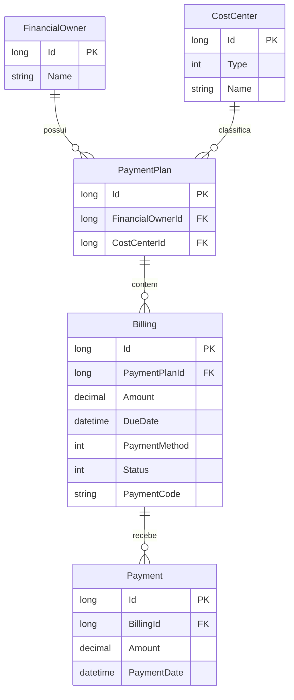

# Desafio:

## CoolSchool - Sistema de Gestão de Planos de Pagamento

CoolSchool simula uma plataforma para gerenciar planos de pagamento de responsáveis financeiros. 
A ideia central é simples: uma instituição precisa organizar cobranças, saber quem pagou, quem está em atraso e gerar os dados de pagamento (boleto ou pix) de forma automática. 
Este projeto propoem resolve isso com uma API, e uma camada GraphQL e uma interface visual simplificada.

---

## O que o sistema faz

Cada plano de pagamento pertence a um responsável financeiro e está ligado a um centro de custo (por exemplo: Matrícula, Mensalidade ou Material). Dentro de cada plano existem as cobranças, que são as parcelas individuais. Cada cobrança tem valor, data de vencimento, método de pagamento e um código gerado automaticamente.

O sistema cuida de:

- Cadastrar responsáveis, centros de custo e planos com suas parcelas
- Calcular automaticamente o valor total do plano
- Gerar o código de pagamento simulado (boleto com linha digitável ou pix com chave em base64)
- Registrar o pagamento de uma cobrança e atualizar o status para Paga
- Calcular se uma cobrança está vencida na consulta, sem precisar salvar isso no banco
- Bloquear pagamento de cobranças já canceladas

---

## Diagrama de Relacionamento



---

## Tecnologias usadas e por que

### .NET 9 com C# 12

O projeto foi feito em .NET 9. A versão 10 foi descartada porque o SDK local ainda não tinha suporte completo e causava incompatibilidade com o gerador de código do cliente GraphQL. C# 12 foi adotado para aproveitar os Primary Constructors, que deixam a injeção de dependência mais limpa e direta.

### PostgreSQL com Entity Framework Core

O banco de dados escolhido foi o PostgreSQL. O acesso ao banco é feito via Entity Framework Core com mapeamento por Fluent API. Isso significa que as tabelas e relações são configuradas em código, separadas das entidades de domínio, o que mantém o domínio limpo. Campos calculados como `TotalAmount` e `IsOverdue` são ignorados pelo EF e nunca salvos no banco.

### Clean Architecture e DDD

O projeto segue Clean Architecture. Isso significa que o código está dividido em camadas com dependências que sempre apontam para dentro, em direção ao domínio. O domínio não sabe nada sobre banco de dados ou API. Quem depende de quem:

- Domain: entidades, enums e interfaces de repositório. Não depende de nada.
- Infrastructure: implementa os repositórios usando EF Core. Depende do Domain.
- Application: serviços que coordenam as regras de negócio. Depende do Domain.
- WebApi: controllers REST e GraphQL. Depende do Application.
- WebUI: interface no navegador. Depende do GraphQL do WebApi.

### DTOs e Contratos de Entrada e Saída

As entidades de domínio nunca são devolvidas diretamente pela API. Isso evita dois problemas conhecidos: o over-posting, onde alguém envia campos que não deveria, e os loops de serialização que acontecem quando as entidades têm referências circulares. Em vez disso, a camada de Application usa classes de Request e Response como contratos fixos.

### Result Pattern

Os serviços não lançam exceções para representar erros de regra de negócio. Em vez disso, retornam um objeto `Result<T>` que pode conter um valor de sucesso ou uma mensagem de erro. Isso deixa o fluxo de erro explícito e previsível, e evita que exceções sejam usadas como controle de fluxo.

### REST e GraphQL lado a lado

A API expõe dois protocolos: REST tradicional e GraphQL via HotChocolate. A decisão foi manter ambos como portas de entrada na camada WebApi. A camada de Application não sabe qual protocolo está sendo usado, ela apenas executa a lógica. Isso significa que REST e GraphQL consomem os mesmos serviços, com as mesmas validações, sem duplicar código.

A camada de Application fica completamente isolada de bibliotecas web como HotChocolate ou ASP.NET MVC. Isso protege o código central do sistema de mudanças de infraestrutura.

### DataLoaders no GraphQL

O maior problema de performance em APIs GraphQL é o chamado problema N+1. Se você listar 10 responsáveis e quiser os planos de cada um, sem cuidado o sistema faria 1 consulta para os responsáveis e 10 consultas para os planos. O DataLoader resolve isso capturando todos os IDs de uma vez e fazendo uma única consulta com `IN (...)` no banco, distribuindo os resultados em memória.

### Segurança no GraphQL

Duas proteções foram implementadas. A primeira limita a profundidade de execução das queries (Depth Limit) para impedir que alguém crie uma query aninhada infinita que travaria o servidor. A segunda desabilita a introspecção em produção, que é o recurso que permite ao cliente "mapear" o schema inteiro da API. Com isso desabilitado, um atacante não consegue explorar a estrutura da API apenas observando o schema.

Em desenvolvimento, o limite de profundidade foi aumentado para 15 porque o cliente StrawberryShake usa queries de introspecção profundas para entender o schema e gerar o código automaticamente.

### Blazor WebAssembly com MudBlazor

A interface foi desenvolvida em Blazor WebAssembly, que roda C# direto no navegador. Para os componentes visuais foi usado o MudBlazor, que oferece tabelas, gráficos, modais e drawers com visual profissional pronto para uso.

A escolha do Blazor mantém C# de ponta a ponta, permitindo que o time compartilhe conhecimento entre o cliente e o servidor.

### StrawberryShake como cliente GraphQL

Para consumir o GraphQL no frontend, foi escolhido o StrawberryShake. Ele lê o schema do backend e gera automaticamente o código do cliente em C#, com tipos fortes. Isso significa que se a API mudar e o contrato quebrar, o erro aparece em tempo de compilação, não em produção.

### CORS em desenvolvimento

O Blazor WebAssembly roda no navegador em uma porta diferente da API. O navegador bloqueia chamadas entre origens diferentes por padrão. Por isso o CORS foi configurado no backend com política aberta em desenvolvimento, e o redirecionamento de HTTP para HTTPS foi desabilitado, porque esse redirecionamento em chamadas cross-origin costuma ser bloqueado pelos navegadores e causava o erro "Failed to fetch".

---

## Arquitetura da interface (Code-Behind e SOLID)

Com o crescimento da interface, os arquivos `.razor` passaram a misturar HTML e lógica C# no mesmo lugar, incluindo classes internas e ciclos de vida embutidos. Isso viola o princípio de responsabilidade única.

A solução foi separar completamente:

- O arquivo `.razor` fica responsável apenas pelo HTML e diretivas de página
- O arquivo `.razor.cs` (partial class) fica com toda a lógica C#: injeção de dependência, métodos, propriedades e ciclos de vida
- A pasta `Models/` dentro do projeto WebUI guarda as classes de dados que são exclusivas da interface e não precisam ser compartilhadas com o backend

As dependências injetadas são declaradas com `[Inject]` no code-behind em vez de `@inject` no arquivo razor. O namespace `CoolShool.WebUI.Models` foi adicionado globalmente no `_Imports.razor` para evitar repetições.

Essa separação torna os componentes testáveis de forma isolada, sem depender do ciclo de vida do Blazor.

---

## Filtragem local nas tabelas

Os campos de busca nas telas usam `Immediate="true"` no MudTextField. Sem esse atributo, o MudBlazor 9 só atualiza a variável C# quando o campo perde o foco. Com ele, o filtro reage a cada tecla digitada. As tabelas do tipo `MudTable` usam o atributo `Filter` ligado a uma função `FilterFunc()` que faz a busca de forma case-insensitive em todos os campos relevantes. Para telas que usam `MudExpansionPanels` em vez de tabela, o filtro é aplicado diretamente via LINQ com `.Where(FilterFunc)`.

---

## Regras de negócio importantes

**Status das cobranças**: O status é armazenado como Emitida, Paga ou Cancelada. O status Vencida é calculado em tempo de consulta: se a data atual for maior que a data de vencimento e a cobrança não estiver paga ou cancelada, ela é considerada vencida.

**Pagamento**: Não é permitido registrar pagamento em uma cobrança cancelada. Um pagamento registrado com sucesso muda o status da cobrança para Paga.

**Exclusão com dependências**: Responsáveis e centros de custo que estão vinculados a planos não podem ser excluídos. Essa validação acontece na camada de serviço antes de qualquer remoção, para evitar registros órfãos no banco.

**Identificadores**: Todos os IDs usam o tipo `long` em todas as camadas. O mapeamento padrão do HotChocolate convertia IDs para strings em Base64, o que causava erros de conversão no Blazor. Por isso o tipo foi mapeado explicitamente para `LongType` em todos os tipos GraphQL.

---

## Enums

**BillingStatus**: 0 = Emitida, 1 = Paga, 2 = Cancelada

**PaymentType**: 0 = Boleto, 1 = Pix

**CostCenterType**: 0 = Matricula, 1 = Mensalidade, 2 = Material, 3 = Outro (exige nome obrigatório)

---

## O que está pronto

O projeto foi concluído em todas as fases planejadas:

- Backend REST com CRUD completo para todos os recursos
- Camada GraphQL com DataLoaders, Depth Limit e proteção de introspecção
- Interface Blazor com Dashboard (KPIs em tempo real, gráfico por centro de custo, agenda de vencimentos), gestão de cobranças, responsáveis, centros de custo e planos de pagamento
- Filtros reativos em todos os módulos
- Separação total de responsabilidades nos componentes (Code-Behind)
- Documentação Scalar ativa na API

---

## Como rodar

### Pré-requisitos

- .NET 9 SDK instalado
- PostgreSQL rodando

### Backend

Atualize a string de conexão no arquivo `appsettings.json` do projeto `CoolShool.WebApi`:

```json
"ConnectionStrings": {
  "DefaultConnection": "Host=localhost;Database=coolschool;Username=seu_usuario;Password=sua_senha"
}
```

Depois execute:

```bash
dotnet build

dotnet ef database update --project CoolShool.Infrastructure --startup-project CoolShool.WebApi

dotnet run --project CoolShool.WebApi
```

A API ficará disponível em `http://localhost:5230`. A documentação Scalar estará em `http://localhost:5230/scalar`.

O playground GraphQL estará em `http://localhost:5230/graphql`.

### Frontend

Com a API rodando, execute em outro terminal:

```bash
dotnet run --project CoolShool.WebUI
```

Acesse `http://localhost:5129` para ver a interface.

---

## Exemplos de uso via REST

### Criar um centro de custo

```bash
curl -X POST http://localhost:5230/api/centros-de-custo \
  -H "Content-Type: application/json" \
  -d '{"type": 1, "name": "Mensalidade Escolar 2025"}'
```

`type`: 0 = Matricula, 1 = Mensalidade, 2 = Material, 3 = Outro (name obrigatorio)

### Criar um responsável financeiro

```bash
curl -X POST http://localhost:5230/api/responsaveis \
  -H "Content-Type: application/json" \
  -d '{"name": "Marcos Rangel"}'
```

### Criar um plano de pagamento

```bash
curl -X POST http://localhost:5230/api/planos-de-pagamento \
  -H "Content-Type: application/json" \
  -d '{
    "responsavelId": 1,
    "centroDeCusto": 1,
    "cobrancas": [
      {"valor": 750.50, "dataVencimento": "2025-04-10", "metodoPagamento": "BOLETO"},
      {"valor": 750.50, "dataVencimento": "2025-05-10", "metodoPagamento": "PIX"},
      {"valor": 750.50, "dataVencimento": "2025-06-10", "metodoPagamento": "BOLETO"}
    ]
  }'
```

### Registrar pagamento de uma cobrança

```bash
curl -X POST http://localhost:5230/api/cobrancas/1/pagamentos \
  -H "Content-Type: application/json" \
  -d '{"amount": 750.50, "paymentDate": "2025-04-05T14:30:00Z"}'
```

### Consultas rápidas

```bash
# Listar planos de um responsável
GET http://localhost:5230/api/responsaveis/1/planos-de-pagamento

# Listar cobranças de um responsável
GET http://localhost:5230/api/cobrancas/responsavel/1

# Total de um plano
GET http://localhost:5230/api/planos-de-pagamento/1/total
```

---

## Exemplos de uso via GraphQL

Acesse o playground em `http://localhost:5230/graphql`.

### Buscar responsáveis com planos e cobranças

```graphql
query GetOwnersWithPlans {
  financialOwners {
    id
    name
    paymentPlans {
      id
      totalAmount
      billings {
        id
        amount
        dueDate
        status
        isOverdue
      }
    }
  }
}
```

### Criar responsável

```graphql
mutation CreateOwner {
  createFinancialOwner(input: {
    name: "Novo Responsável"
  }) {
    id
    name
  }
}
```

### Criar plano de pagamento

```graphql
mutation CreatePlan {
  createPaymentPlan(input: {
    financialOwnerId: 1,
    costCenterId: 1,
    billings: [
      { amount: 1000, dueDate: "2026-12-10", paymentMethod: BOLETO }
    ]
  }) {
    id
    totalAmount
  }
}
```

---

## Estrutura de pastas

```
CoolSchool/
  CoolSchool.Domain/
    Models/         - Entidades de dominio
    Enums/          - BillingStatus, PaymentType, CostCenterType
    Interfaces/     - Contratos dos repositorios

  CoolSchool.Application/
    Contracts/
      Requests/     - Dados de entrada das operacoes
      Responses/    - Dados de saida das operacoes
    Services/       - Logica de negocio

  CoolSchool.Infrastructure/
    Persistence/
      Configurations/ - Mapeamento FluentAPI das entidades
      AppDbContext.cs
    Repositories/   - Implementacao dos repositorios com EF Core

  CoolShool.WebApi/
    Controllers/    - Endpoints REST
    GraphQL/
      Types/        - Schema GraphQL (mapeamento das entidades)
      Query/        - Consultas GraphQL
      Mutation/     - Mutacoes GraphQL
      DataLoaders/  - Motor anti N+1

  CoolShool.WebUI/
    Models/         - Classes de dados exclusivas da interface
    Pages/          - Componentes Blazor (.razor + .razor.cs)
```

---

Marcos Rangel
